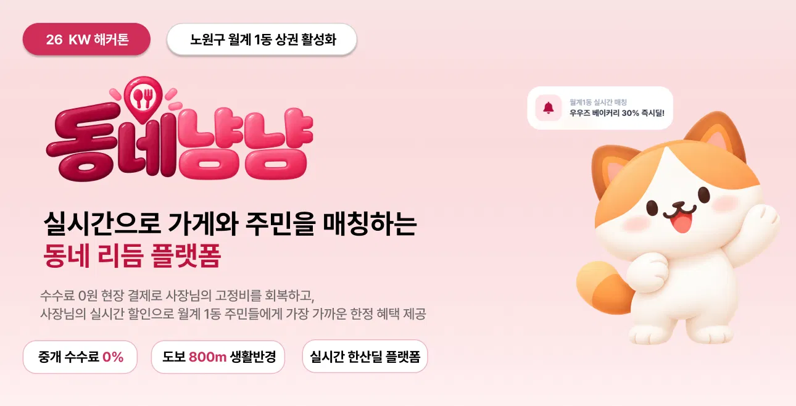
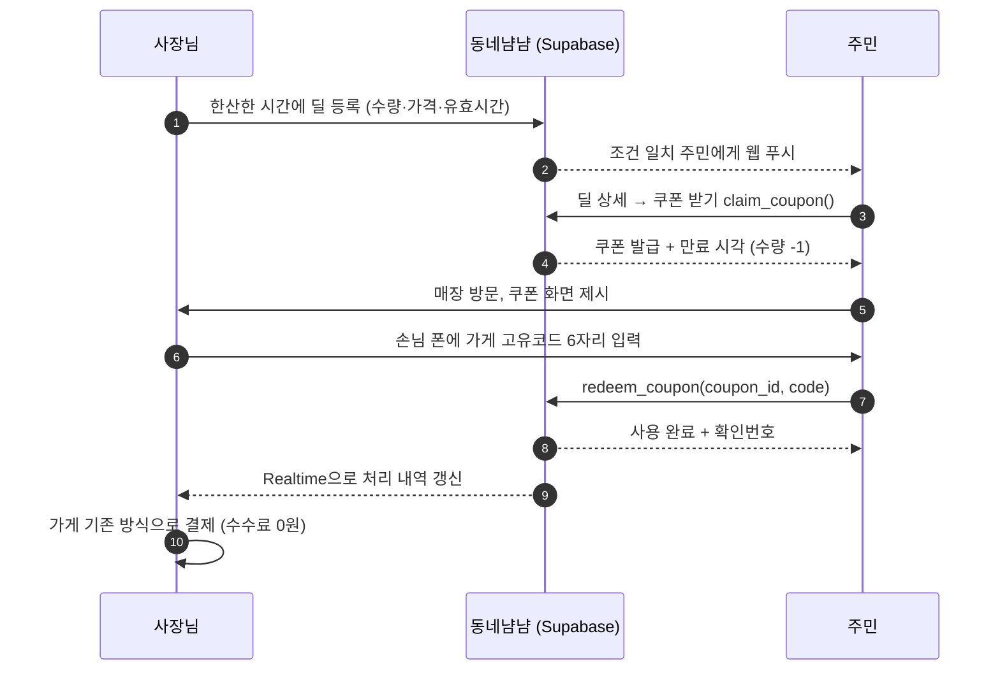
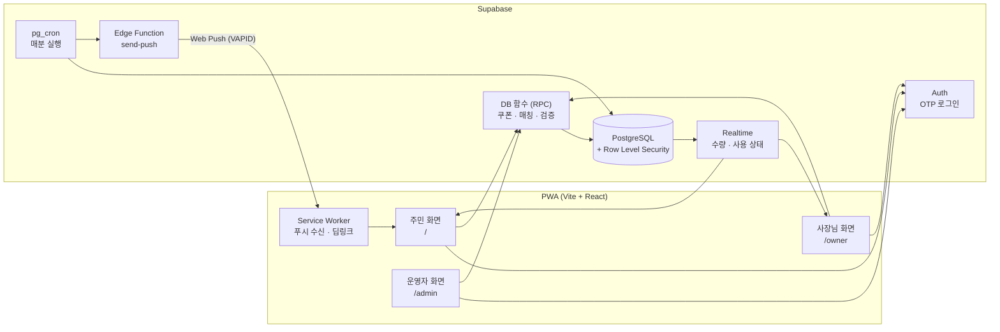
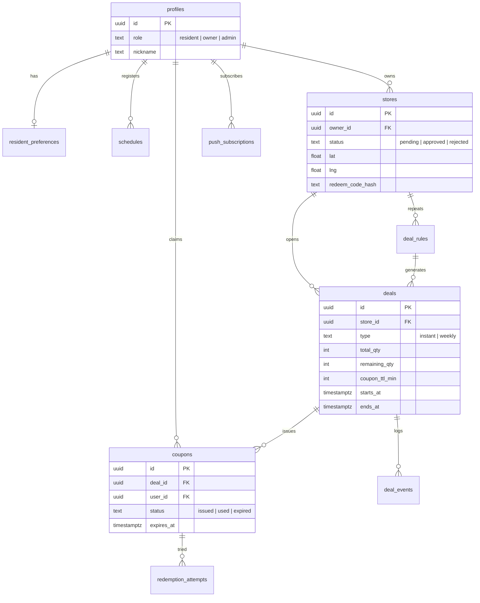
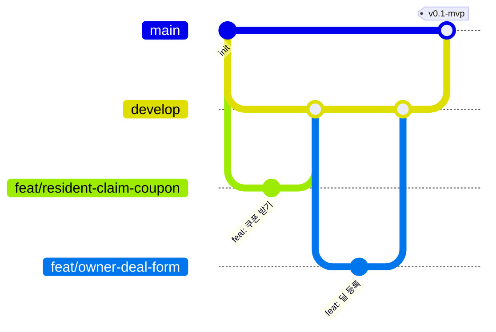

<div align="center">



<br />
<br />

**가게의 한산한 시간과 주민의 여유 시간을 실시간으로 잇는 월계1동 타임딜 PWA**

<br />

[](https://react.dev/)
[](https://www.typescriptlang.org/)
[](https://vite.dev/)
[](https://supabase.com/)
[](https://tailwindcss.com/)
[](https://vercel.com/)
[](.github/workflows/ci.yml)

[서비스 소개](#-서비스-소개) · [핵심 기능](#-핵심-기능) · [아키텍처](#-시스템-아키텍처) · [기술 스택](#-기술-스택) · [핵심 구현](#-핵심-구현) · [시작하기](#-시작하기) · [팀](#-팀-라스트팡)

</div>

<br />

## 📌 목차

1. [서비스 소개](#-서비스-소개)
2. [문제 정의와 해결 방식](#-문제-정의와-해결-방식)
3. [핵심 기능](#-핵심-기능)
4. [서비스 흐름](#-서비스-흐름)
5. [시스템 아키텍처](#-시스템-아키텍처)
6. [기술 스택](#-기술-스택)
7. [데이터 모델](#-데이터-모델)
8. [보안 설계](#-보안-설계)
9. [핵심 구현](#-핵심-구현)
10. [프로젝트 구조](#-프로젝트-구조)
11. [시작하기](#-시작하기)
12. [개발 컨벤션](#-개발-컨벤션)
13. [로드맵](#-로드맵)
14. [팀 라스트팡](#-팀-라스트팡)
15. [오픈소스 및 출처](#-오픈소스-및-출처)

<br />

## 🐾 서비스 소개

> **동네냠냠**은 소상공인의 한산한 시간대를 동네 주민의 방문으로 바꾸는 **실시간 한산딜 플랫폼**입니다.
> 2026 KW 해커톤 주제 **"노원구 월계1동 상권 활성화"** 를 위해 팀 **라스트팡**이 기획·개발했습니다.

| 핵심 가치 | 설명 |
|---|---|
| **중개 수수료 0%** | 결제는 앱 밖에서 가게의 기존 방식으로 진행합니다. 플랫폼은 매칭만 담당하므로 사장님에게 수수료가 발생하지 않습니다. |
| **도보 800m 생활반경** | 주민이 걸어서 갈 수 있는 거리(기본 반경 800m, 200m~2km 조절)의 가게만 추천합니다. |
| **실시간 한산딜** | 사장님이 한산한 시간에 30초 만에 딜을 올리면, 조건이 맞는 주민에게 즉시 알림이 갑니다. |

<br />

## 🎯 문제 정의와 해결 방식

| 구분 | 문제 | 동네냠냠의 해결 |
|---|---|---|
| **사장님** | 한산한 시간에도 임대료·인건비 같은 고정비는 그대로 나간다 (매몰 비용) | 비는 시간에만 한정 수량 딜을 열어 매몰 비용을 **방문 동인**으로 전환 |
| **사장님** | 배달·중개 플랫폼 수수료가 부담된다 | 수수료 0원, 현장 결제 |
| **주민** | 동네 가게 할인 정보를 찾기 어렵고, 정보가 와도 지금 갈 수 있는지 모른다 | 요일·시간대·카테고리·반경 설정에 맞는 딜만 **지금 이 순간** 알림 |
| **상권** | 특정 시간대에 유동 인구가 끊기는 데드존(Dead Zone) | 가게마다 다른 한산 시간을 분산 매칭해 상권 전체의 리듬을 채움 |

<br />

## ✨ 핵심 기능

### 주민

| 기능 | 설명 |
|---|---|
| 생활 패턴 설정 | 활동 요일, 시간대, 선호 카테고리, 도보 반경을 한 번 설정 |
| 반복 일정 등록 | 등교·퇴근·공강 같은 일정을 등록하면 일정 15분 전 근처 딜을 알림 |
| 거리순 딜 추천 | 현재 진행 중이고 반경 안에 있는 딜을 가까운 순으로 표시 |
| 선착순 쿠폰 받기 | 받는 순간 수량이 확보되고, 유효시간 카운트다운 시작 |
| 매장 사용 처리 | 사장님이 손님 폰에 가게 고유코드 6자리를 입력하면 사용 완료 |
| 웹 푸시 + 딥링크 | 알림을 누르면 해당 딜 상세 화면으로 바로 이동 |

### 사장님

| 기능 | 설명 |
|---|---|
| 30초 딜 등록 | 즉시딜 / 요일반복딜을 템플릿으로 빠르게 등록 |
| 실시간 처리 내역 | 쿠폰 사용이 일어나면 새로고침 없이 목록에 반영 |
| 가게 고유코드 관리 | 코드는 발급 직후 한 번만 표시, 언제든 재발급 가능 |
| 성과 리포트 | 사용 건수, 추정 회복 매출, 신규 방문 비율, 시간대별 분석 |

### 운영자

| 기능 | 설명 |
|---|---|
| 가게 입점 승인 | 신청 목록 확인, 좌표 검증, 승인 시 고유코드 자동 발급 |

<br />

## 🔄 서비스 흐름



<br />

## 🏗 시스템 아키텍처

별도 API 서버 없이 **Supabase**를 백엔드로 사용합니다. 수량 차감·쿠폰 사용·매칭 같은 핵심 규칙은 모두 **DB 함수(RPC)** 에서 처리하고, 클라이언트는 화면만 담당합니다. 따라서 조작된 요청으로 수량이나 쿠폰 상태를 바꿀 수 없습니다.



| 구성 요소 | 역할 |
|---|---|
| **RPC 함수** | 쿠폰 발급·사용·재발급 등 상태를 바꾸는 모든 쓰기 작업을 트랜잭션 안에서 처리 |
| **RLS** | 역할(주민/사장님/운영자)별 읽기·쓰기 권한을 DB 레벨에서 강제 |
| **Realtime** | 딜 잔여 수량, 쿠폰 사용 완료를 클라이언트에 즉시 반영 |
| **pg_cron** | 만료 쿠폰 정리와 수량 복귀, 일정 15분 전 알림 대상 선정, 요일반복딜 생성 |
| **Edge Function** | VAPID 비밀키를 서버에만 두고 웹 푸시를 발송 |

<br />

## 🛠 기술 스택

### Frontend

| 기술 | 용도 | 선택 이유 |
|---|---|---|
| **React 18 + TypeScript** | UI | DB 스키마에서 자동 생성한 타입으로 프론트-백 접점을 고정 |
| **Vite** | 빌드 | 빠른 개발 서버, PWA 플러그인 연동 |
| **vite-plugin-pwa** | PWA | manifest · Service Worker 자동 생성, 홈 화면 설치 |
| **React Router** | 라우팅 | 주민(`/`) · 사장님(`/owner`) · 운영자(`/admin`) 영역 분리, 딥링크 |
| **TanStack Query** | 서버 상태 | 캐시 · 재시도 · 로딩 상태 관리 |
| **Tailwind CSS** | 스타일 | 디자인 토큰(색·모서리·간격)을 설정 파일 한 곳에서 관리 |
| **React Hook Form + Zod** | 폼 검증 | 딜 등록·일정 입력의 예외 규칙을 스키마로 선언 |

### Backend (BaaS)

| 기술 | 용도 |
|---|---|
| **Supabase PostgreSQL** | 트랜잭션과 행 잠금으로 수량 동시성 보장 |
| **Row Level Security + RPC** | 권한 규칙을 DB에서 강제 |
| **Supabase Auth** | OTP 기반 로그인 |
| **Supabase Realtime** | 실시간 수량·처리 내역 |
| **pg_cron** | 예약 작업 |
| **pgcrypto** | 가게 고유코드 해시 저장, 안전한 난수 생성 |
| **Edge Functions + Web Push (VAPID)** | 푸시 발송 |

### DevOps & Quality

| 기술 | 용도 |
|---|---|
| **GitHub Actions** | PR마다 타입 검사 · 린트 · 테스트 · 빌드 |
| **Vercel** | `main` 머지 시 자동 배포, PR별 미리보기 URL |
| **Vitest** | 거리 계산 · 매칭 규칙 단위 테스트 |
| **ESLint + Prettier + Husky** | 코드 스타일 통일, 커밋 전 자동 검사 |

> **의도적으로 도입하지 않은 것:** 지도 SDK, 전역 상태관리 라이브러리(Redux 등).
> 월계1동 범위(가게 수십~수백 개)에서는 하버사인 거리 계산으로 충분하고, 로그인 사용자 같은 전역 상태는 React Context로 처리합니다.

<br />

## 🗄 데이터 모델



| 테이블 | 설명 | 핵심 제약 |
|---|---|---|
| `profiles` | 사용자와 역할 | role은 본인이 수정 불가 |
| `stores` | 가게 정보, 승인 상태 | 고유코드는 **해시로만 저장**, 주민은 조회 불가 |
| `resident_preferences` | 요일·시간대·카테고리·반경 | 반경 200~2000m, 기본 800m |
| `schedules` | 주민 반복 일정 | 종료 시각 > 시작 시각 |
| `deals` | 실제 진행되는 딜 | `remaining_qty ≥ 0` |
| `deal_rules` | 요일반복딜 규칙 | 예약 작업이 요일마다 `deals` 행을 생성 |
| `coupons` | 발급된 쿠폰 | 한 사람당 한 딜에 유효 쿠폰 1개 (부분 유니크 인덱스) |
| `redemption_attempts` | 코드 입력 시도 기록 | 실패 횟수 제한 판단 |
| `deal_events` | 노출·조회·발급·사용·만료·푸시 클릭 | 성과 리포트 집계 원천 |
| `push_subscriptions` | 웹 푸시 구독 정보 | endpoint 유니크 |

<br />

## 🔐 보안 설계

### 역할별 접근 권한 (RLS)

| 테이블 | 주민 | 사장님 | 운영자 |
|---|---|---|---|
| `stores` | 승인된 가게의 공개 정보만 (뷰) | 본인 가게 조회·수정, 승인 상태 변경 불가 | 전체 조회, 승인 처리 |
| `deals` | 진행 중인 딜 조회 | 승인된 본인 가게 딜 생성·종료 | 전체 조회 |
| `coupons` | 본인 쿠폰 조회, 쓰기는 RPC로만 | 본인 가게 딜의 쿠폰 조회 | 전체 조회 |
| `resident_preferences`, `schedules` | 본인 행만 CRUD | 접근 불가 | 접근 불가 |

### 설계 원칙

- **권한 검사는 화면이 아니라 DB가 강제합니다.** 수량과 쿠폰 상태를 바꾸는 쓰기는 클라이언트에 직접 허용하지 않고 `security definer` RPC로만 처리합니다.
- **가게 고유코드는 주민 기기로 내려가지 않습니다.** 서버에서 `pgcrypto`의 `crypt()`로 해시 비교만 합니다.
- **무차별 대입 방지:** 같은 주민이 10분 안에 5회 틀리면 사용 처리가 차단됩니다. 가게 단위가 아닌 주민 단위로 제한해, 악의적인 한 명이 가게 전체를 막지 못하게 했습니다.
- **위치정보 최소화:** 주민의 실시간 위치는 어떤 테이블에도 저장하지 않습니다. 추천 함수의 입력값으로만 쓰고 버리며, 푸시 매칭용 "자주 있는 곳"은 약 100m 단위로 반올림해 저장합니다.
- **비밀키 관리:** `service_role` 키와 VAPID 비밀키는 저장소와 클라이언트에 포함하지 않습니다.

<br />

## 💡 핵심 구현

### 1. 동시성 제어: 선착순 쿠폰 초과 발급 방지

남은 수량이 1개일 때 두 명이 동시에 누르면, "조회 후 차감" 방식은 둘 다 성공할 수 있습니다.
`SELECT ... FOR UPDATE`로 딜 행을 잠가 두 번째 요청이 첫 번째 트랜잭션이 끝날 때까지 기다린 뒤 마감 상태를 보도록 했습니다.

```sql
create or replace function claim_coupon(p_deal_id uuid)
returns jsonb language plpgsql security definer set search_path = public as $$
declare v_deal deals; v_coupon coupons;
begin
  select * into v_deal from deals where id = p_deal_id for update;  -- 행 잠금

  if not found or v_deal.status <> 'active'
     or now() not between v_deal.starts_at and v_deal.ends_at then
    return jsonb_build_object('ok', false, 'error', 'DEAL_NOT_ACTIVE');
  end if;
  if v_deal.remaining_qty <= 0 then
    return jsonb_build_object('ok', false, 'error', 'SOLD_OUT');
  end if;
  if exists (select 1 from coupons where deal_id = p_deal_id
             and user_id = auth.uid() and status in ('issued','used')) then
    return jsonb_build_object('ok', false, 'error', 'ALREADY_CLAIMED');
  end if;

  update deals set remaining_qty = remaining_qty - 1 where id = p_deal_id;
  insert into coupons (deal_id, user_id, expires_at, status)
  values (p_deal_id, auth.uid(),
          now() + make_interval(mins => v_deal.coupon_ttl_min), 'issued')
  returning * into v_coupon;
  insert into deal_events (deal_id, user_id, type) values (p_deal_id, auth.uid(), 'claim');

  return jsonb_build_object('ok', true, 'coupon', to_jsonb(v_coupon));
end $$;
```

**검증 방법:** 수량 5개 딜에 20건을 동시에 호출해 발급이 정확히 5건인지 확인합니다. → [`supabase/tests`](supabase/tests)

### 2. 쿠폰 사용 처리: 서버 전용 코드 검증

```sql
-- redeem_coupon 핵심부
select c.* into v_coupon from coupons c
  where c.id = p_coupon_id and c.user_id = auth.uid() for update;

if v_coupon.status <> 'issued' or v_coupon.expires_at < now() then
  return jsonb_build_object('ok', false, 'error', 'COUPON_NOT_USABLE');
end if;

-- 10분 내 5회 실패 시 차단
if (select count(*) from redemption_attempts
    where user_id = auth.uid() and success = false
      and created_at > now() - interval '10 minutes') >= 5 then
  return jsonb_build_object('ok', false, 'error', 'TOO_MANY_ATTEMPTS');
end if;

if v_store.redeem_code_hash <> crypt(p_code, v_store.redeem_code_hash) then
  insert into redemption_attempts (user_id, store_id, coupon_id, success)
  values (auth.uid(), v_store.id, p_coupon_id, false);
  return jsonb_build_object('ok', false, 'error', 'WRONG_CODE');
end if;

update coupons set status = 'used', used_at = now() where id = p_coupon_id;
```

> 실패는 `raise exception` 대신 결과값으로 반환합니다. 예외를 던지면 트랜잭션이 롤백되어 **실패 기록까지 사라지기** 때문입니다.

### 3. 자동 만료와 수량 복귀

`pg_cron`이 1분마다 만료된 쿠폰을 정리하고, 같은 트랜잭션 안에서 수량을 되돌립니다.

```sql
create or replace function expire_coupons() returns void language sql as $$
  with expired as (
    update coupons set status = 'expired'
    where status = 'issued' and expires_at < now()
    returning deal_id
  )
  update deals d set remaining_qty = d.remaining_qty + x.cnt
  from (select deal_id, count(*) cnt from expired group by deal_id) x
  where d.id = x.deal_id;
$$;

select cron.schedule('expire-coupons', '* * * * *', 'select expire_coupons()');
```

> 예약 작업은 최대 1분 늦을 수 있지만, `redeem_coupon`이 만료 시각을 직접 확인하므로 만료된 쿠폰이 사용되는 일은 없습니다.

### 4. 거리 계산 (하버사인 공식)

지도 SDK 없이 두 좌표 사이의 직선거리를 계산합니다.

$$
d = 2R \arcsin\sqrt{\sin^2\frac{\Delta\varphi}{2} + \cos\varphi_1 \cos\varphi_2 \sin^2\frac{\Delta\lambda}{2}}
$$

```ts
// src/shared/lib/geo.ts
const EARTH_RADIUS_M = 6_371_000;
const WALK_M_PER_MIN = 67; // 약 4km/h, 가정치

const toRad = (deg: number) => (deg * Math.PI) / 180;

export function distanceMeters(lat1: number, lng1: number, lat2: number, lng2: number): number {
  const dPhi = toRad(lat2 - lat1);
  const dLambda = toRad(lng2 - lng1);
  const a =
    Math.sin(dPhi / 2) ** 2 +
    Math.cos(toRad(lat1)) * Math.cos(toRad(lat2)) * Math.sin(dLambda / 2) ** 2;
  return 2 * EARTH_RADIUS_M * Math.asin(Math.sqrt(a));
}

export function walkingMinutes(meters: number): number {
  return Math.max(1, Math.round(meters / WALK_M_PER_MIN));
}
```

> 화면에는 직선거리 기준임을 알리기 위해 "약 N분"으로 표기합니다.

### 5. 웹 푸시와 딥링크

1. 주민이 알림을 허용하면 구독 정보를 `push_subscriptions`에 저장
2. 딜 등록 시점, 그리고 매분 "일정 15분 전" 주민을 DB 함수가 선정
3. Edge Function `send-push`가 VAPID 비밀키로 발송
4. 알림 데이터의 `/deals/{id}?src=push`를 Service Worker가 열어 딜 상세로 이동
5. 주민당 하루 발송 횟수를 제한해 알림 피로도를 관리

<br />

## 📁 프로젝트 구조

기능(feature) 단위로 폴더를 나눠 두 개발자가 같은 파일을 동시에 수정하지 않도록 했습니다.

```
dongne-nyangnyang/
├─ .github/
│  ├─ workflows/ci.yml            # PR마다 lint · typecheck · test · build
│  ├─ pull_request_template.md
│  └─ ISSUE_TEMPLATE/
├─ docs/
│  ├─ assets/banner.png           # README 배너
│  └─ ...                         # ERD, API 목록, 화면 흐름도
├─ public/icons/                  # PWA 아이콘
├─ src/
│  ├─ app/                        # 라우터, 레이아웃, AuthProvider
│  ├─ shared/
│  │  ├─ ui/                      # Button, Card, CodeInput, CountdownTimer ...
│  │  ├─ lib/                     # supabase.ts, geo.ts, time.ts
│  │  └─ types/database.ts        # Supabase CLI 자동 생성 타입
│  ├─ features/
│  │  ├─ auth/                    # 로그인 · OTP
│  │  ├─ resident/                # 온보딩, 선호 설정, 일정, 딜, 쿠폰, 알림
│  │  ├─ owner/                   # 가입, 가게, 딜 등록, 처리 내역, 리포트
│  │  └─ admin/                   # 입점 승인
│  ├─ sw.ts                       # Service Worker
│  └─ main.tsx
├─ supabase/
│  ├─ migrations/                 # 테이블 · RLS · 함수 SQL
│  ├─ functions/send-push/        # Edge Function
│  ├─ tests/                      # 동시성 · RPC 테스트
│  └─ seed.sql                    # 시연용 월계1동 가게 · 딜 데이터
├─ .env.example
└─ README.md
```

### 화면 라우트

| 영역 | 경로 | 화면 |
|---|---|---|
| 주민 | `/login` | OTP 로그인 |
| 주민 | `/onboarding/*` | 동의 → 프로필 · 자주 있는 곳 → 생활 패턴 → 알림 권한 |
| 주민 | `/` | 홈 (거리순 딜 목록) |
| 주민 | `/deals/:id` | 딜 상세 · 쿠폰 받기 |
| 주민 | `/coupons`, `/coupons/:id` | 내 쿠폰, 카운트다운 · 코드 입력 · 사용 완료 |
| 주민 | `/me/schedules` | 반복 일정 관리 |
| 사장님 | `/owner/signup`, `/owner/pending` | 가입 · 승인 대기 |
| 사장님 | `/owner`, `/owner/deals/new` | 홈 · 딜 등록 |
| 사장님 | `/owner/redemptions` | 실시간 처리 내역 |
| 사장님 | `/owner/report` | 성과 리포트 |
| 사장님 | `/owner/settings` | 가게 고유코드 재발급 |
| 운영자 | `/admin/stores` | 입점 승인 · 거절 |

<br />

## 🚀 시작하기

### 요구 사항

- Node.js 20+
- Supabase CLI
- (로컬 DB 실행 시) Docker

### 설치 및 실행

```bash
# 1. 저장소 클론
git clone https://github.com/<ORG>/<REPO>.git
cd <REPO>

# 2. 의존성 설치
npm install

# 3. 환경 변수 설정
cp .env.example .env.local
# .env.local에 Supabase URL, anon key, VAPID 공개키 입력

# 4. 로컬 Supabase 실행 및 마이그레이션 적용
npx supabase start
npx supabase db reset        # migrations + seed.sql 적용

# 5. 개발 서버 실행
npm run dev
```

### 환경 변수

| 변수 | 설명 | 노출 범위 |
|---|---|---|
| `VITE_SUPABASE_URL` | Supabase 프로젝트 URL | 클라이언트 |
| `VITE_SUPABASE_ANON_KEY` | 공개 anon 키 (RLS 전제) | 클라이언트 |
| `VITE_VAPID_PUBLIC_KEY` | 웹 푸시 공개키 | 클라이언트 |
| `VAPID_PRIVATE_KEY` | 웹 푸시 비밀키 | **Edge Function 시크릿에만** |

### 스크립트

| 명령 | 설명 |
|---|---|
| `npm run dev` | 개발 서버 |
| `npm run build` | 프로덕션 빌드 |
| `npm run lint` | ESLint 검사 |
| `npm test` | Vitest 실행 |
| `npx supabase gen types typescript --local > src/shared/types/database.ts` | DB 타입 재생성 |

> **iOS 참고:** iOS에서 웹 푸시는 iOS 16.4 이상에서 **홈 화면에 추가한 PWA**로 실행했을 때만 동작합니다. 앱은 Safari 접속 시 설치 안내 배너를 표시합니다.

<br />

## 🤝 개발 컨벤션

### 브랜치 전략



| 브랜치 | 용도 | 예시 |
|---|---|---|
| `main` | 시연 · 배포 (항상 동작 상태 유지) | — |
| `develop` | 통합 · 미리보기 | — |
| `feat/영역-기능-이슈` | 기능 개발 | `feat/resident-claim-coupon-12` |
| `fix/영역-내용-이슈` | 버그 수정 | `fix/owner-report-empty-state-31` |
| `db/내용-이슈` | 마이그레이션 | `db/coupon-expire-cron-15` |
| `hotfix/내용` | 긴급 수정 | `hotfix/push-deeplink-crash` |

### 커밋 메시지 (Conventional Commits)

```
<type>(<scope>): <내용> (#이슈)

feat(resident): 딜 받기 버튼에 쿠폰 발급 RPC 연결 (#12)
fix(owner): 재발급 후 이전 코드가 통과하던 문제 수정 (#27)
test(db): 수량 5개 딜 동시 20건 발급 테스트
```

- **type:** `feat` `fix` `refactor` `style` `test` `docs` `chore` `ci`
- **scope:** `resident` `owner` `admin` `shared` `db` `pwa`

### PR 규칙

- 기능 → `develop`: 리뷰 승인 1건 + CI 통과 후 **Rebase and merge**
- `develop` → `main`: 마일스톤마다 **Merge commit** + 태그 (`v0.1-mvp`, `v1.0-final`)
- DB 변경은 반드시 `supabase/migrations`의 SQL 파일로 커밋 (대시보드 직접 수정 금지)

<br />

## 🗺 로드맵

- [ ] **v0.1 MVP** — 딜 등록 → 쿠폰 받기 → 매장 사용 → 리포트 한 바퀴 동작
- [ ] **v0.2** — 웹 푸시 · 딥링크, 반복 일정 알림, 요일반복딜
- [ ] **v1.0** — 확정 디자인 적용, 알림 피로도 제한, 실기기(Android · iOS) 검증
- [ ] **Post-Hackathon** — 휴대폰 본인인증 전환, 위치정보 관련 법률 검토, 월계1동 실증

<br />

## 👥 팀 라스트팡

<div align="center">

| .png" width="100" /> | .png" width="100" /> | .png" width="100" /> | .png" width="100" /> |
|:---:|:---:|:---:|:---:|
| **정연진** | **이름** | **이름** | **이름** |
| 역할 | 역할 | 역할 | 역할 |
| [@github](https://github.com/<GITHUB_ID>) | [@github](https://github.com/<GITHUB_ID>) | [@github](https://github.com/<GITHUB_ID>) | [@github](https://github.com/<GITHUB_ID>) |

</div>

<br />

## 📚 오픈소스 및 출처

본 프로젝트에서 사용한 오픈소스와 외부 리소스입니다. 추가 시 이 목록을 갱신합니다.

| 이름 | 용도 | 라이선스 |
|---|---|---|
| [React](https://github.com/facebook/react) | UI 라이브러리 | MIT |
| [Vite](https://github.com/vitejs/vite) | 빌드 도구 | MIT |
| [vite-plugin-pwa](https://github.com/vite-pwa/vite-plugin-pwa) | PWA | MIT |
| [TanStack Query](https://github.com/TanStack/query) | 서버 상태 관리 | MIT |
| [React Router](https://github.com/remix-run/react-router) | 라우팅 | MIT |
| [Tailwind CSS](https://github.com/tailwindlabs/tailwindcss) | 스타일 | MIT |
| [Zod](https://github.com/colinhacks/zod) | 스키마 검증 | MIT |
| [React Hook Form](https://github.com/react-hook-form/react-hook-form) | 폼 관리 | MIT |
| [supabase-js](https://github.com/supabase/supabase-js) | Supabase 클라이언트 | MIT |

<br />

---

<div align="center">

**2026 KW 해커톤 · 노원구 월계1동 상권 활성화**

Made with 🧡 by Team 라스트팡

</div>
